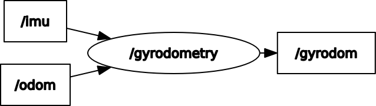

# gyrodometry_ros


[](https://opensource.org/licenses/MIT)

ROS implementation of Gyrodometry

## Environment
- Ubuntu 20.04
- ROS Noetic

## Install and Build
```
# clone repository
cd /path/to/your/catkin_ws/src
git clone https://github.com/ToshikiNakamura0412/gyrodometry_ros.git

# build
cd /path/to/your/catkin_ws
rosdep install -riy --from-paths src --rosdistro noetic # Install dependencies
catkin build gyrodometry_ros -DCMAKE_BUILD_TYPE=Release # Release build is recommended
```

## How to use
```
rosrun gyrodometry_ros gyrodometry_node
```

## Node I/O


## Nodes
### gyrodometry_node
#### Published Topics
- /gyrodom (`nav_msgs/Odometry`)
  - The gyrodometry data

#### Subscribed Topics
- /imu (`sensor_msgs/Imu`)
  - The imu data
- /odom (`nav_msgs/Odometry`)
  - The odometry data

## References
- https://lilaboc.work/archives/18464338.html
